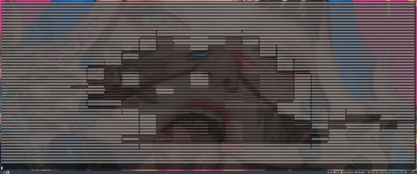

# GIF to ASCII Art converter.  


The aim of this project was to teach myself go and also make somthing I thought was cool. I have previously made somthing that takes in a image and turns it to ascii art,  
and thought, how much more difficult could it be to make a movie ??  (Famous last words.)  
I was able to make it in the end but it probably has some bugs on more complex gifs ...  
  
## Requirements  
- Go 1.16 or higher  
- The following Go packages:  
    -   github.com/gdamore/tcell/v2
    -   github.com/nfnt/resize

## Usage  
1. Build the project:  
```bash
go build -o gif-to-ascii-art 
```
2. Run the executable with the path to the GIF file:  
```bash
./gif-to-ascii-art ./path/to/your.gif 
```

